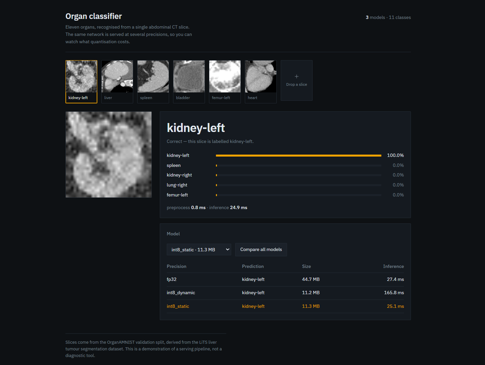

# Organ Classifier Service

Organ classification on abdominal CT slices, served as a containerised ONNX
inference API with a browser demo. One trained network is published at three
precisions and served side by side, so the cost of quantisation can be measured
rather than assumed.

**Live demo: <https://organ-classifier-service-61ec09f04650.herokuapp.com>**

> The demo runs on a free-tier dyno that sleeps when idle. The first request
> after a pause takes around 20 seconds while it wakes.



## Results

ResNet18 fine-tuned on OrganAMNIST at 224 px, eleven classes, selected at epoch
25 of 30 on validation balanced accuracy.

| Artefact | Size | Val balanced accuracy | Agreement with fp32 | Max logit deviation |
|---|---|---|---|---|
| fp32 | 44.69 MB | 0.9929 | — | — |
| int8 dynamic | 11.23 MB | 0.9931 | 0.9954 | 10.19 |
| int8 static | 11.29 MB | 0.9929 | 0.9978 | 2.65 |

Two findings, both of which shaped the deployment.

**Quantisation is free here.** All three artefacts agree to within a twentieth
of a percentage point, which on 6 491 validation images is noise rather than a
difference. The int8 figure being marginally higher is not an improvement:
around thirty images changed their prediction and a few happened to fall the
right way. Since accuracy does not distinguish the candidates, the deployment
choice is made on cost.

**Static and dynamic quantisation are not interchangeable.** They produce
artefacts of the same size and the same accuracy, but static reproduces the
fp32 model roughly four times more faithfully, and on a desktop CPU it runs
about four times faster than dynamic. Dynamic quantisation recomputes
activation scales on every request, and across twenty convolution layers that
overhead dominates. It is built for workloads where MatMul dominates, which a
convolutional network is not.

Inference latency, single-threaded on CPU. The dyno column is what the
deployment decision was made on; the desktop column is there because the two
disagree in an instructive way.

| Artefact | Desktop CPU | Free-tier dyno (median) | Dyno spread |
|---|---|---|---|
| fp32 | 22.3 ms | 33.8 ms | 28.0 – 36.4 |
| int8 dynamic | 73.8 ms | 221.4 ms | 206 – 247 |
| int8 static | 17.5 ms | 27.9 ms | 27.5 – 28.4 |

The penalty for dynamic quantisation grows from roughly fourfold on a desktop
to nearly eightfold on shared CPU. Recomputing activation scales is pure
compute, and pure compute is exactly what is scarce there.

Static quantisation is the deployed default, but not for the reason the size
column suggests. It is only about eighteen per cent faster than fp32, not the
two- to fourfold speedup int8 promises on hardware with VNNI instructions,
which this tier evidently lacks. What it does deliver is a quarter of the size
and a latency spread of 0.9 ms against 8.4 ms for fp32 — and for a tail
latency target, consistency is worth more than a better median.

Preprocessing costs 0.4 to 0.5 ms regardless of artefact, under two per cent of
a request. That settles a question raised early on: serving at a lower input
resolution would not have paid off nearly as much as the compute saving
suggests, because the fixed cost of decoding and resampling does not shrink
with it.

**The test split has not been read.** Selection across artefacts happens on
validation alone, and the test evaluation runs once, after the deployment
choice is committed. The git history shows that order rather than asserting it.

## Quickstart

```bash
docker compose up
# http://localhost:8000
```

The image carries all three artefacts, fetched from the GitHub Release at build
time. Which of them get loaded is set by `MODEL_PATHS`; with none set, every
artefact in `/app/models` is served.

### Development

```bash
uv sync --extra train --group dev
uv run pytest -m "not slow"
uv run ruff check .
uv run uvicorn "organ_service.serve.app:app" --factory --port 8000
```

### Reproducing the artefacts

```bash
organ-service download --size 224
organ-service train --config configs/train_224.yaml
organ-service export --checkpoint runs/resnet18_224/checkpoint.pt --model-version v0.1.0
organ-service quantize --model artifacts/resnet18_224_fp32.onnx
organ-service samples --size 224
```

Training takes about ten minutes on an RTX 5070. The pipeline is deterministic:
a rerun at the same seed reproduced the figures above across training, export
and quantisation.

## API

| Endpoint | Purpose |
|---|---|
| `POST /predict` | Classify an uploaded image. `?model=` selects an artefact, `?top_k=` truncates. |
| `GET /health` | Loaded artefacts with version, resolution and commit |
| `GET /ready` | Readiness for platform health checks |
| `GET /metrics` | Prometheus exposition |
| `GET /docs` | OpenAPI |

## Architecture

```
  training                              serving
  ────────                              ───────
  download → train → export → quantize → GitHub Release
                │       │        │              │
                └───────┴────────┴──→ preprocessing ←── FastAPI
                        shared transform          ONNX Runtime
```

`preprocessing.py` is imported by both halves. The transform is defined once,
so the tensor produced at inference time is the one the network was trained on.
Training/serving skew is the most common way an image classifier degrades
silently in production, and defining the transform twice is how it usually
happens. Resize and geometric augmentation are composed into a single affine
matrix and applied in one resampling step, so the augmented and unaugmented
paths cannot drift apart.

Each artefact carries its own input resolution, normalisation constants and
class names as ONNX metadata. The service reads them from whichever model it
loads, so artefacts at different precisions and resolutions are interchangeable
without touching service code. This closes a failure mode that produces no
error and no crash: serving a 224 px model through a service configured for
64 px yields only quietly wrong predictions.

Measured in the container with all three artefacts loaded and requests served:
**186 MB resident**, against the 512 MB quota of the target platform.

## Design decisions

Each entry records the decision, the reason, and what would change it.

**No Kubernetes.** One stateless service on one node. Compose covers that, and
an orchestrator here would demonstrate unfamiliarity with its cost rather than
familiarity with the tool. *Would change with:* multiple nodes, autoscaling, or
rolling deploys with traffic splitting.

**No database.** Nothing is persisted; a prediction is a pure function of its
input. *Would change with:* request logging for drift analysis, and even then
JSONL or SQLite long before a server.

**No model registry.** Artefacts are published as GitHub Release assets, and
`/health` reports the version and commit actually loaded. *Would change with:*
several people training, parallel versions in production, or approval
workflows.

**No monitoring stack.** `/metrics` exposes request counts by model and outcome
and latency histograms split by stage. Whether anything scrapes it is a
deployment concern and belongs outside the image. *Would change with:* SLOs and
alerting.

**No DVC.** The dataset is an immutable public artefact pinned by package
version and checksum, so there is no evolving data to version. The question DVC
would answer, which bytes produced these numbers, is answered by a manifest
recording the archive hash, split sizes and licence, carried into `metrics.json`
alongside the results. *Would change with:* private or growing data, or labels
that change over time.

**No quantisation-aware training.** Post-training static quantisation costs
0.00 percentage points of balanced accuracy, which bounds the maximum possible
gain from QAT at zero. *Would change with:* a static quantisation loss above
roughly one percentage point.

**ONNX Runtime instead of torch at serving time.** The runtime image installs
the serving dependency group alone; torch, timm, medmnist, onnx and sympy live
in the training and dev extras. ONNX Runtime unpacks to 66 MB against several
hundred megabytes for torch and its dependencies, which is the difference
between fitting the memory quota and not. The separation is declared in
`pyproject.toml` and guarded by a test that fails if a training framework
appears among the runtime dependencies, rather than relying on discipline.

**The TorchScript exporter, not dynamo.** The dynamo exporter produces a graph
that runs correctly, with parity against the torch model around 2e-06, but one
that ONNX shape inference rejects at the classifier head. Quantisation calls
that inference internally, so a dynamo-exported artefact cannot be quantised.
The deprecated exporter is the one that completes the pipeline. Dynamo remains
available behind `--exporter dynamo`, so the decision is recorded rather than
hidden and can be retried against a future torch release.

## Testing

```bash
pytest -m "not slow"      # 99 tests, no torch required
```

Three are worth calling out.

**ONNX parity.** Torch and ONNX Runtime are compared on the same inputs after
every export, inside the export command rather than only in the suite: an
artefact that disagrees with the network it came from should never reach disk.
Random inputs rather than real slices, because noise exercises the numeric
range far harder than in-distribution data.

**Agreement rate.** Parity is the wrong test for a quantised model, whose
logits must differ. What matters is whether any decision changed, which is what
agreement measures. A model can shift every logit and still agree on all of
them.

**The runtime dependency boundary.** The suite fails if torch, timm or medmnist
appears among the runtime dependencies, so the image cannot silently grow by
several hundred megabytes.

CI installs no torch. The artefact pipeline is exercised against small
hand-built ONNX graphs, which keeps the default job under two minutes.

## Limitations

- Trained on one seed. The figures are single-run, with no confidence
  intervals.
- One architecture at one resolution. The pipeline supports others through
  configuration, but nothing else has been trained.
- OrganAMNIST is a curated, pre-cropped benchmark. Performance on raw clinical
  DICOM would be substantially worse.
- Single-label classification only. Several MedMNIST datasets are multi-label
  or ordinal; the training command refuses them rather than reporting plausible
  but meaningless numbers.
- The free-tier dyno sleeps, so the first request after a pause is slow.
- **Not a diagnostic tool.** This is a demonstration of a serving pipeline.

## Licence

Code is MIT. Dataset licensing and citation are in `MODEL_CARD.md`.
